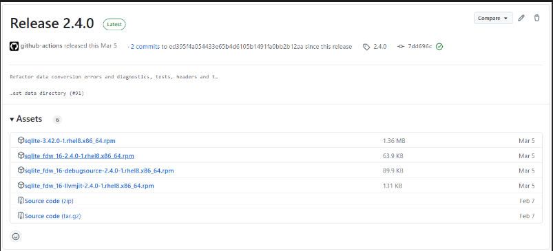
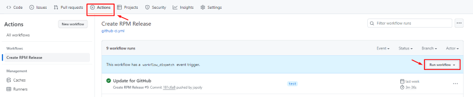

Usage of creating sqlite_fdw RPM packages
=====================================

This document is about how to create and publish rpm packages of sqlite_fdw to GitHub. 
- It provided 2 tools to create SQLite FDW RPMs.  
Both tools use the sqlite_fdw.spec file from the Postgres community as a base.  
Community's spec file will download source code of sqlite_fdw from Internet and build it. Therefore, if you wants to build rpm file of a stable version of sqlite_fdw automatically, you can use community's spec file. In case of you already have source code of sqlite_fdw (possibly with some custom modification), and want to build rpm file from current source code, you can use this tool. Refer [pgrpms](https://git.postgresql.org/gitweb/?p=pgrpms.git;a=blob;f=rpm/redhat/main/non-common/sqlite_fdw/main/sqlite_fdw.spec;h=864e7ce58825eea3a7658b55305fb1365d51e917;hb=df216ffca23020a436ca964a294e229a9073f4a8)
	- One is for creating RPMs with [PGSpider](#creating-sqlite_fdw-rpm-packages-for-pgspider).
		- The PGSpider RPM package is required. It must be released on PGSpider repository first.
		- The PGSpider RPM package have released on PGSpider [Assets of Release](https://github.com/pgspider/pgspider/releases).
	- Another is for creating RPMs with [PostgreSQL](#creating-sqlite_fdw-rpm-packages-for-postgresql).
- Additionally, we also provide Github Actions for creating sqlite_fdw RPM packages for [PGSpider](#usage-of-github-actions).


Environment for creating rpm of sqlite_fdw
=====================================
The description below is used in the specific Linux distribution RockyLinux8.
1. Docker
	- Install Docker
		```sh
		sudo yum install -y yum-utils
		sudo yum-config-manager --add-repo https://download.docker.com/linux/centos/docker-ce.repo
		sudo yum install -y docker-ce docker-ce-cli containerd.io
		sudo systemctl enable docker
		sudo systemctl start docker
		```
	- Enable the currently logged in user to use docker commands
		```sh
		sudo gpasswd -a $(whoami) docker
		sudo chgrp docker /var/run/docker.sock
		sudo systemctl restart docker
		```
	- Proxy settings (If your network must go through a proxy)
		```sh
		sudo mkdir -p /etc/systemd/system/docker.service.d
		sudo tee /etc/systemd/system/docker.service.d/http-proxy.conf << EOF
		[Service]
		Environment="HTTP_PROXY=http://proxy:port/"
		Environment="HTTPS_PROXY=http://proxy:port/"
		Environment="NO_PROXY=localhost,127.0.0.1"
		EOF
		sudo systemctl daemon-reload
		sudo systemctl restart docker
		```
2. Get the required files  
	```sh
	git clone https://github.com/pgspider/sqlite_fdw.git
	```

Creating sqlite_fdw rpm packages for PGSpider
=====================================
1. Preconditions
	PGSpider RPM packages are must-have packages. They need to be released first on the [pgspider](https://github.com/pgspider/pgspider) repository.
2. File used here
	- rpm/deps/sqlite.spec
	- rpm/sqlite_fdw_spec_pgspider.patch
	- rpm/env_rpmbuild.conf
	- rpm/Dockerfile_rpm
	- rpm/create_rpm_binary_with_PGSpider.sh
3. Configure `rpm/env_rpmbuild.conf` file
	- Configure proxy (optional)
		```sh
		proxy: The ip address of proxy server.
		no_proxy: List of domains to exclude proxying.
		```
	- Configure the registry location to publish the package and version of the packages
		```sh
		ACCESS_TOKEN=						# Fill in the access token of your account. It will be used for authentication when publish docker image or packages to GitHub. Refer (https://docs.github.com/en/authentication/keeping-your-account-and-data-secure/managing-your-personal-access-tokens#creating-a-personal-access-token-classic) for how to create a access token.
		PGSPIDER_BASE_POSTGRESQL_VERSION=	# Base version of Postgres for PGSpider. For example: 16.
		PGSPIDER_RELEASE_VERSION=			# The release version of PGSpider. It used to version of PGSpider rpm package. For example: 4.0.0-1.
		OWNER_GITHUB=						# Owner of this repository on Gihub (For example: https://github.com/pgspider/parquet_s3_fdw. The owner is pgspider).
		PGSPIDER_PROJECT_GITHUB=			# Repository name of pgspider. Normally it is "pgspider". If you forked or import it into a new repository, it will be different).
		PACKAGE_RELEASE_VERSION=1			# The number of times this version of the sqlite_fdw has been packaged.
		SQLITE_VERSION=						# Release version of SQLite. For example: 3.42.0. You can check in: https://www.sqlite.org/chronology.html.
		SQLITE_YEAR=						# The year that the sqlite version was released. For example: 2023 for version 3.42.0. You can check in: https://www.sqlite.org/chronology.html.
		SQLITE_FDW_RELEASE_VERSION= 		# Release version of sqlite_fdw. For example: 2.4.0.
		SQLITE_FDW_PROJECT_GITHUB=			# Repository name of sqlite_fdw. Normally it is "sqlite_fdw". If you forked or import it into a new repository, it can be different).
		SQLITE_FDW_RELEASE_ID=				#Before using shell script, you need to create a release (with a tag name) in GitHub manually. And then you need to access into [here](https://docs.github.com/en/graphql/overview/explorer) and execute the below script to get release id (need to update **owner**, **name** and **tagName**):
		```
		```sh
		{
			repository(owner: "pgspider", name: "sqlite_fdw") {
					release(tagName: "2.4.0") {
					databaseId
					createdAt
				}
			}
		}
		```
4. Build execution
	```sh
	chmod +x rpm/create_rpm_binary_with_PGSpider.sh
	./rpm/create_rpm_binary_with_PGSpider.sh
	```
5. Confirmation after finishing executing the script
	- Terminal displays a success message. 
		```
		{"message":"201 Created"}
		...
		{"message":"201 Created"}
		```
	- RPM Packages are stored on the assert of Release. For example:

		

Creating sqlite_fdw rpm packages for PostgreSQL
=====================================
This tool will create sqlite_fdw rpm using PostgreSQL with the difference from PGSpider:
- Use script `create_rpm_binary_with_PostgreSQL.sh` instead of `create_rpm_binary_with_PGSpider.sh`.
- Use the parameters `POSTGRESQL_VERSION`, `PACKAGE_RELEASE_VERSION`, `SQLITE_VERSION`, `SQLITE_YEAR`, `SQLITE_FDW_RELEASE_VERSION`.
- The RPM packages after creation will be stored locally in the `fdw_rpm_with_postgres` directory and will not be uploaded to the repository.

1. File used here
	- rpm/deps/sqlite.spec
	- rpm/sqlite_fdw_spec_postgres.patch
	- rpm/env_rpmbuild.conf
	- rpm/Dockerfile_rpm
	- rpm/create_rpm_binary_with_PostgreSQL.sh
2. Configure `rpm/env_rpmbuild.conf` file
	- Configure proxy (optional)
		```sh
		proxy: The ip address of proxy server. 
		no_proxy: List of domains to exclude proxying.
		```
	- Configure the registry location to publish the package and version of the packages
		```sh
		POSTGRESQL_VERSION=					# PostgreSQL rpm packages version. For example: 16.0-1. You can check in: https://yum.postgresql.org/packages/.
		PACKAGE_RELEASE_VERSION=1			# The number of times this version of the sqlite_fdw has been packaged.
		SQLITE_VERSION=						# Release version of SQLite. For example: 3.42.0. You can check in: https://www.sqlite.org/chronology.html.
		SQLITE_YEAR=						# The year that the sqlite version was released. For example: 2023 for version 3.42.0. You can check in: https://www.sqlite.org/chronology.html.
		SQLITE_FDW_RELEASE_VERSION= 		# Release version of sqlite_fdw. For example: 2.4.0.
		```
3. Build execution
	- Execute the script.
	```sh
	chmod +x rpm/create_rpm_binary_with_PostgreSQL.sh
	./rpm/create_rpm_binary_with_PostgreSQL.sh
	```
	- RPM Packages are stored on the `fdw_rpm_with_postgres` folder in the root directory.

Usage of GitHub Actions
=====================================
1. Configure `.github/workflows/github-ci.yml` file, update value of the below variable (refer to [this section](#creating-sqlite_fdw-rpm-packages-for-pgspider)):
	- OWNER_GITHUB
	- PGSPIDER_PROJECT_GITHUB
	- PGSPIDER_RELEASE_VERSION
	- PGSPIDER_BASE_POSTGRESQL_VERSION
	- PACKAGE_RELEASE_VERSION
	- PGSPIDER_RELEASE_PACKAGE_VERSION
	- SQLITE_FDW_RELEASE_VERSION
	- SQLITE_VERSION
	- SQLITE_YEAR

2. Access to Actions tab and click on Run workflow.

	
